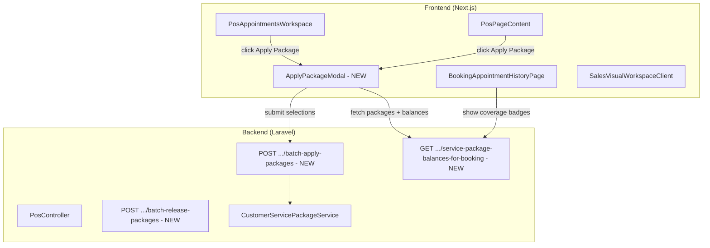

# Apply Package Modal Feature

## Architecture Overview



---

## Phase 1: Backend — New Batch Package Endpoints

### 1A. New endpoint: Fetch packages with line-level eligibility

**Route:** `GET /api/proxy/pos/appointments/{bookingId}/eligible-packages`

**Response structure:**
```json
{
  "packages": [
    {
      "id": 12,
      "customer_service_package_id": 45,
      "package_name": "Premium Facial Package",
      "status": "active",
      "expires_at": "2026-12-31",
      "items": [
        {
          "booking_service_id": 3,
          "service_name": "Facial Treatment",
          "total_qty": 10,
          "used_qty": 3,
          "remaining_qty": 7,
          "reserved_qty": 1,
          "available_qty": 6
        }
      ],
      "eligible_lines": [
        {
          "line_type": "main_service",
          "line_index": 0,
          "booking_service_id": 3,
          "service_name": "Facial Treatment",
          "can_apply": true,
          "already_applied": false
        },
        {
          "line_type": "addon",
          "line_index": 1,
          "booking_service_id": 7,
          "service_name": "Eye Mask",
          "can_apply": false,
          "reason": "No balance for this service"
        }
      ]
    }
  ],
  "current_claims": [
    {
      "line_type": "main_service",
      "line_index": 0,
      "booking_service_id": 3,
      "customer_service_package_id": 45,
      "usage_id": 99
    }
  ]
}
```

**Location:** Add method `eligiblePackagesForAppointment()` in [PosController.php](backend/ecommerce_gentlegurl_backend_api/app/Http/Controllers/Ecommerce/PosController.php)

**Logic:**
- Fetch appointment with `main_services` + `add_ons` (all `booking_service_id` values)
- Fetch all active, non-expired `CustomerServicePackage` for the customer
- For each package, compute per-service available qty (remaining - reserved by other bookings)
- Cross-match against appointment service lines to build `eligible_lines`
- Include `current_claims` showing what's already applied to this booking

### 1B. New endpoint: Batch apply packages

**Route:** `POST /api/proxy/pos/appointments/{bookingId}/batch-apply-packages`

**Request body:**
```json
{
  "applications": [
    {
      "customer_service_package_id": 45,
      "booking_service_id": 3,
      "line_type": "main_service",
      "line_index": 0,
      "used_qty": 1
    },
    {
      "customer_service_package_id": 45,
      "booking_service_id": 7,
      "line_type": "addon",
      "line_index": 1,
      "used_qty": 1
    }
  ]
}
```

**Logic:**
- Validate member, appointment ownership, package active + not expired
- For each application, call `CustomerServicePackageService::reserve()` with `source=POS`, `source_ref_id=booking.id`
- Use a DB transaction so all-or-nothing
- Return updated appointment snapshot (with new `package_offset`, `package_status` per line)

### 1C. New endpoint: Batch release packages

**Route:** `POST /api/proxy/pos/appointments/{bookingId}/batch-release-packages`

**Request body:**
```json
{
  "releases": [
    { "usage_id": 99 }
  ]
}
```

**Logic:** Release specific reserved claims (not all claims on the booking).

### 1D. Extend appointment detail response

Add per-line `package_claims` to `resolveAppointmentSnapshot()`:
- Each `main_services[]` item and `add_ons[]` item gets a `package_claim` field: `{ customer_service_package_id, package_name, usage_id, status }` or `null`
- This powers both the appointment workspace UI and the history/reports display

---

## Phase 2: Frontend — Apply Package Modal Component

### New file: `src/components/pos/ApplyPackageModal.tsx`

**Design (Package-first layout):**

```
+---------------------------------------------------+
|  Apply Package                              [X]   |
+---------------------------------------------------+
|  Customer: Jane Doe (Member)                      |
|                                                   |
|  ┌─────────────────────────────────────────────┐  |
|  │ Premium Facial Package                      │  |
|  │ Status: Active  |  Expires: 2026-12-31      │  |
|  │                                             │  |
|  │  ☑ Facial Treatment (Main)    6 remaining   │  |
|  │  ☐ Eye Mask (Add-on)         3 remaining   │  |
|  │  ◻ Body Scrub (disabled - not in appt)      │  |
|  └─────────────────────────────────────────────┘  |
|                                                   |
|  ┌─────────────────────────────────────────────┐  |
|  │ Body Care Bundle                            │  |
|  │ Status: Active  |  Expires: 2026-06-30      │  |
|  │                                             │  |
|  │  ◻ Facial Treatment (disabled - 0 remain)   │  |
|  │  ☐ Body Scrub (Add-on)       2 remaining   │  |
|  └─────────────────────────────────────────────┘  |
|                                                   |
|  ┌─────────────────────────────────────────────┐  |
|  │ Expired Package (entire card disabled)      │  |
|  │ Status: Expired  |  Expired: 2026-01-01     │  |
|  └─────────────────────────────────────────────┘  |
|                                                   |
+---------------------------------------------------+
|  [Cancel]                    [Apply 2 Packages]   |
+---------------------------------------------------+
```

**Key UX rules:**
- Only shown when customer is a MEMBER
- Each package card is a collapsible section
- Service lines matching the appointment are listed under each package
- Checkbox enabled if: package active + not expired + `available_qty > 0` + line not already claimed by another package
- Disabled with reason tooltip if not eligible
- A service line can only be claimed by ONE package (selecting it under Package A disables it under Package B)
- Already-applied claims show as pre-checked with "Applied" badge + option to unclaim
- Footer shows count and "Apply N Package(s)" button
- Uses `posBodyModalPortal` pattern consistent with existing modals
- Modal size: `lg` or `xl` (scrollable content area)

**State management:**
- `selections: Map<lineKey, { customer_service_package_id, booking_service_id, line_type, line_index }>`
- `releases: usageId[]` (for unclaiming)
- Submit calls batch-apply + batch-release in sequence

---

## Phase 3: POS Appointments Workspace Integration

**File:** [PosAppointmentsWorkspace.tsx](frontend/ecommerce_gentlegurl_crm/src/components/pos/PosAppointmentsWorkspace.tsx)

Changes:
1. Replace current single "Apply Package" button logic with "Apply Package" button that opens `ApplyPackageModal`
2. Button visibility: only when `customer` is a member (has `customer_id`) and appointment status allows package application
3. On modal submit success, refresh appointment detail (existing `loadAppointmentDetail()`)
4. Update settlement panel to show per-line package indicators (small "PKG" badge or "Package" tag next to covered lines)
5. Keep existing `can_apply_package` check for button enable/disable

---

## Phase 4: POS Main Page Integration (Optional/Concurrent)

**File:** [PosPageContent.tsx](frontend/ecommerce_gentlegurl_crm/src/components/PosPageContent.tsx)

Two integration points:

### 4A. Add Service to Cart (booking modal)
- After service + add-ons are selected, before final "Add to Cart":
- Show "Apply Package" option if member has eligible packages
- Reuse `ApplyPackageModal` adapted for pre-booking context (reserve with `source_ref_id` = temp cart item ID)

### 4B. Settlement in Cart
- Settlement cart items already have claim/unclaim buttons
- Replace simple claim/unclaim with same `ApplyPackageModal` for multi-line selection
- Targets: `cart.appointment_settlement_items[]` line items

---

## Phase 5: Reports & History — Package Coverage Indicators

### 5A. Appointment History

**File:** [BookingAppointmentHistoryPage.tsx](frontend/ecommerce_gentlegurl_crm/src/components/booking/BookingAppointmentHistoryPage.tsx)

- Backend `mapHistoryBooking()` already returns `package_offset`
- Extend to include per-service-line `package_claim` data
- In **detail drawer** (`BookingServicesAddOnsSection`): show a subtle "Package" badge/tag next to service lines that were covered by a package
- In **table row**: if any service line has package coverage, show a small package icon or "PKG" indicator in the service cell

### 5B. Sales Visual Report

**File:** [SalesChannelReportPage.tsx](frontend/ecommerce_gentlegurl_crm/src/components/SalesChannelReportPage.tsx)

- For settlement-type transaction rows, if package offset > 0, show "Package Applied" indicator
- In order detail drawer line items, mark lines covered by package

---

## Implementation Priority

1. **Backend endpoints** (Phase 1) — foundation for everything
2. **ApplyPackageModal component** (Phase 2) — reusable modal
3. **POS Appointments integration** (Phase 3) — primary use case per user request
4. **Reports/History indicators** (Phase 5) — visibility requirement
5. **POS Main Page integration** (Phase 4) — secondary, "顺便做"

---

## Files to Create/Modify

| Action | File |
|--------|------|
| CREATE | `frontend/.../src/components/pos/ApplyPackageModal.tsx` |
| MODIFY | `frontend/.../src/components/pos/PosAppointmentsWorkspace.tsx` |
| MODIFY | `frontend/.../src/components/PosPageContent.tsx` |
| MODIFY | `frontend/.../src/components/booking/BookingAppointmentHistoryPage.tsx` |
| MODIFY | `frontend/.../src/components/booking/BookingServicesAddOnsSection.tsx` |
| MODIFY | `frontend/.../src/components/SalesChannelReportPage.tsx` |
| MODIFY | `backend/.../app/Http/Controllers/Ecommerce/PosController.php` |
| MODIFY | `backend/.../app/Services/Booking/CustomerServicePackageService.php` |
| ADD ROUTE | `backend/.../routes/api.php` (3 new routes) |

---

## Existing Code to Leverage

- **Modal pattern:** `posBodyModalPortal` + `PosModalShell` for consistent look
- **Package types:** `servicePackageTypes.ts` (`ServicePackage`, `ServicePackageItem`)
- **Customer package types:** `CustomerPackage`, `CustomerPackageBalance` from `CustomerServicePackagesPage.tsx`
- **Backend service:** `CustomerServicePackageService::reserve()` / `releaseReservedClaimsBySource()`
- **Financial summary:** `resolveAppointmentFinancialSummary()` already computes `package_offset`
- **Add-on structure:** `main_services[].add_ons[]` each have `booking_service_id` for matching
