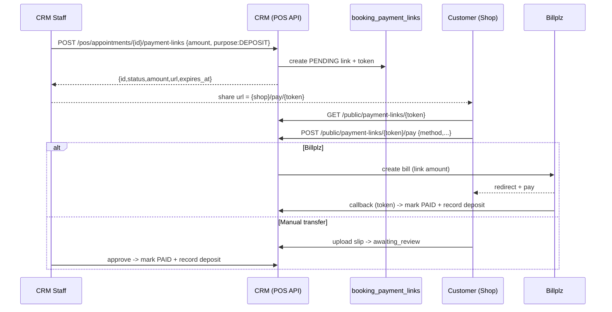

# Appointment Deposit Payment Links

## Confirmed decisions
- Backend endpoints live under `/pos/appointments/{id}/payment-links` (guarded by `permission:pos.checkout`), matching the existing appointment workspace. Public pay endpoints are token-based and unauthenticated.
- "Cancel" = invalidate the URL only. Unpaid links can be cancelled anytime. Paid links auto-close (staff may archive/hide). Cancellation NEVER refunds or touches collected deposit money (refunds are a separate flow).
- A confirmed link payment records a normal deposit (`orders` + `order_items.line_type = booking_deposit` + `booking_payments`), so it shows up in existing deposit transactions / Edit Settlement and credits the balance automatically via `resolveAppointmentFinancialSummary`.
- The link payer is independent of the booking owner: we capture payer contact on the link record and never write to `bookings.customer_id` / `guest_*`.

## Flow

## Backend (Laravel: `backend/ecommerce_gentlegurl_backend_api`)

1. Migration `booking_payment_links` table: `id`, `booking_id`, `token` (unique), `purpose` (default `DEPOSIT`), `amount`, `status` (`PENDING|PAID|CANCELLED|EXPIRED`), `provider` (nullable, chosen by payer), `payment_ref` (billplz bill id / manual ref), `order_id` (nullable FK to created deposit order), `booking_payment_id` (nullable), payer fields (`payer_customer_id`, `payer_name`, `payer_phone`, `payer_email`), manual fields (`manual_slip_path`, `manual_slip_url`, `manual_review_status`), `paid_at`, `expires_at`, `created_by`, `cancelled_by`, `cancelled_at`, `notes`, timestamps.
2. Model `app/Models/Booking/BookingPaymentLink.php` with `booking()`, `order()`, `createdBy()` relations + `isPayable()` helper (PENDING and not expired).
3. Service `app/Services/Booking/BookingPaymentLinkService.php`:
   - `create(Booking, amount, purpose, expiresAt, staffId)` -> generates token, builds public URL from `config('services.frontend_url_booking')` as `{base}/pay/{token}`.
   - `createBillplzBillForLink(link, method, option)` -> mirrors `PaymentController::createBillplzBill` (see [PaymentController.php](backend/ecommerce_gentlegurl_backend_api/app/Http/Controllers/Booking/PaymentController.php) lines 634-733) but uses the link amount + a token-scoped callback/redirect.
   - `markPaidAndRecordDeposit(link, provider, ref, payer)` -> creates `Order` (completed/paid) + `OrderItem(line_type=booking_deposit, booking_id)` + `BookingPayment(PAID)` and calls the existing deposit sync so balance updates. This mirrors `PosController::addAppointmentDeposit` (PosController.php ~1597-1654) and reuses `syncBookingDepositAmountFromOrderItems`. Idempotent by `payment_ref`.
   - `cancel(link, staffId)` and `expireDue()`.
4. Controller `app/Http/Controllers/Ecommerce/PosAppointmentPaymentLinkController.php` (POS/staff): `store` (create), `index` (list for appointment), `cancel`, `approveManual` (approve uploaded slip -> `markPaidAndRecordDeposit`).
5. Controller `app/Http/Controllers/Booking/PaymentLinkController.php` (public/token): `show`, `pay`, `uploadSlip`, `billplzCallback` (uses `?token=`). Reuses bank-account mapping and gateway-option resolution patterns from `PaymentController`.
6. Routes in [routes/api.php](backend/ecommerce_gentlegurl_backend_api/routes/api.php):
   - POS group (with `permission:pos.checkout`, near lines 462-527): `POST/GET /pos/appointments/{id}/payment-links`, `POST /pos/appointments/{id}/payment-links/{linkId}/cancel`, `POST .../{linkId}/approve`.
   - Public group (near lines 1200-1237): `GET /public/payment-links/{token}`, `POST /public/payment-links/{token}/pay`, `POST /public/payment-links/{token}/upload-slip`, `POST /public/payment-links/callback`.

## CRM frontend (`frontend/ecommerce_gentlegurl_crm`)

7. Add `PosPaymentLink` type to [posAppointmentTypes.ts](frontend/ecommerce_gentlegurl_crm/src/components/pos/posAppointmentTypes.ts).
8. New component `src/components/pos/PosAppointmentPaymentLinksSection.tsx` (styled like [PosAppointmentDepositCreditSection.tsx](frontend/ecommerce_gentlegurl_crm/src/components/pos/PosAppointmentDepositCreditSection.tsx)):
   - "Generate Deposit Link" form: amount input (default = current `balance_due`/outstanding, editable), purpose `DEPOSIT`, optional expiry.
   - On create: show the URL with copy button + QR (reuse the existing `api.qrserver.com` pattern already in the workspace).
   - List existing links: status badge (Pending/Paid/Cancelled/Expired), amount, payer, created-by, copy URL, Cancel button (unpaid), Approve button (manual slip pending review).
9. Wire into [PosAppointmentsWorkspace.tsx](frontend/ecommerce_gentlegurl_crm/src/components/pos/PosAppointmentsWorkspace.tsx): render the new section in the settlement panel (and inside the Edit Settlement modal near the deposit section ~6497-6531). Add `fetch`-based handlers hitting `/api/proxy/pos/appointments/{id}/payment-links[...]` (matching the existing `/api/proxy/*` cookie pattern). Create Appointment modal stays unchanged.

## Booking shop frontend (`frontend/booking_gentlegurl_shop`)

10. Add API helpers to [apiClient.ts](frontend/booking_gentlegurl_shop/src/lib/apiClient.ts): `getPaymentLink(token)`, `payPaymentLink(token, payload)`, `uploadPaymentLinkSlip(token, file, note)` (all via `/api/proxy/public/payment-links/...`).
11. New public route `src/app/pay/[token]/page.tsx` + `PayLinkClient.tsx`:
    - Loads link; shows appointment summary + amount + status.
    - Payment method selector reusing the [CartDrawer.tsx](frontend/booking_gentlegurl_shop/src/components/booking/CartDrawer.tsx) gateway UI (Billplz card / online banking / manual transfer) via `getBookingPaymentGateways` / `getBookingBankAccounts` / `getBillplzPaymentGatewayOptions`.
    - Optional payer name/phone/email inputs (prefilled if logged in, but never changes booking owner).
    - Billplz -> redirect to `payment_url`; manual transfer -> show bank details + slip upload (reuse `ThankYouClient`/`UploadReceiptModal` patterns).
    - Paid/cancelled/expired states render a clear terminal message.

## Out of scope
- No changes to the Create Appointment modal or a separate "Create Online Booking" flow.
- No refund/reversal handling (separate business flow).
- Full "pay entire settlement balance online" is not built; links collect deposit-type contributions (staff sets the amount, which credits toward the balance).